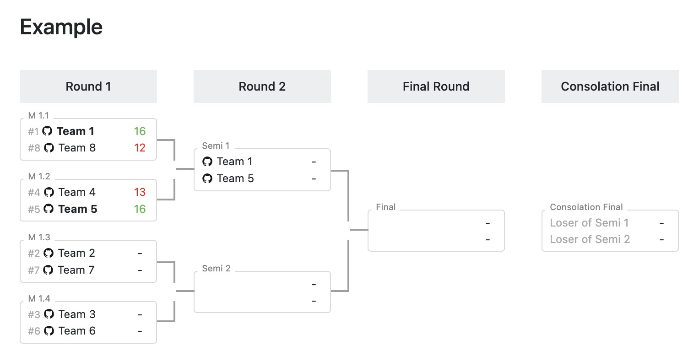

# brackets-viewer.js

A simple library to display tournament brackets (round-robin, single elimination, double elimination)

It contains all the logic needed to display tournaments.

- Supports translation ([i18next](https://www.i18next.com/))
- Full vanilla JS (no framework)
- A full working example of creating and displaying brackets (see [`/demo/with-ui.html`](demo/with-ui.html))
- Themes supported, with CSS variables (see [`/demo/themes`](/demo/themes))

[](https://www.npmjs.com/package/brackets-viewer)
[](https://www.npmjs.com/package/brackets-viewer)
[](https://www.jsdelivr.com/package/npm/brackets-viewer)
[](https://packagequality.com/#?package=brackets-viewer)



## How to use?

Import the library from npm using [jsDelivr](https://www.jsdelivr.com/):

```html
<link rel="stylesheet" href="https://cdn.jsdelivr.net/npm/brackets-viewer/dist/brackets-viewer.min.css" />
<script type="text/javascript" src="https://cdn.jsdelivr.net/npm/brackets-viewer/dist/brackets-viewer.min.js"></script>
```

Or from GitHub with (you can replace `@master` by any branch name, tag name or commit id):

```html
<link rel="stylesheet" href="https://cdn.jsdelivr.net/gh/Drarig29/brackets-viewer.js@master/dist/brackets-viewer.min.css" />
<script type="text/javascript" src="https://cdn.jsdelivr.net/gh/Drarig29/brackets-viewer.js@master/dist/brackets-viewer.min.js"></script>
```

Now, you can use it with data generated using [brackets-manager](https://github.com/Drarig29/brackets-manager.js) or with crafted data following the [brackets-model](https://github.com/Drarig29/brackets-model).

## Demos

To quickly test, you can also try the demos by visiting `/demo/index.html`.

To use `json-server`, you can:

- Run the npm script named `db` to serve the static database file `/demo/db.json`

  ```bash
  npm run db
  ```

- Or use directly the `db.json` file generated by unit tests in the `brackets-manager` project

  ```bash
  npx json-server --watch path/to/brackets-manager/db.json
  ```

## Credits

This library has been created to be used by the [Nantarena](https://nantarena.net/).

It has been inspired by:

- [Toornament](https://www.toornament.com/en_US/) (design inspiration)
- [Responsive Tournament Bracket](https://codepen.io/jimmyhayek/full/yJkdEB) (connection between matches in plain CSS)
